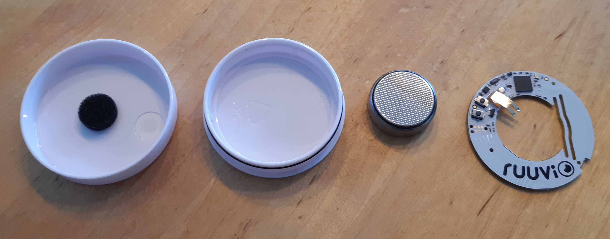
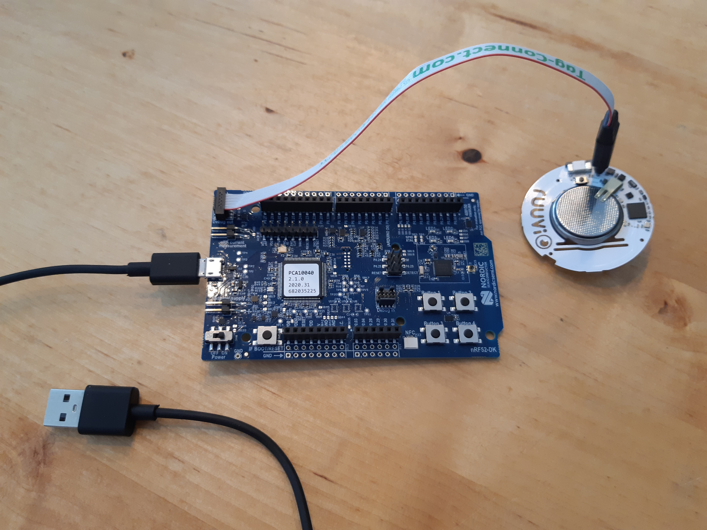
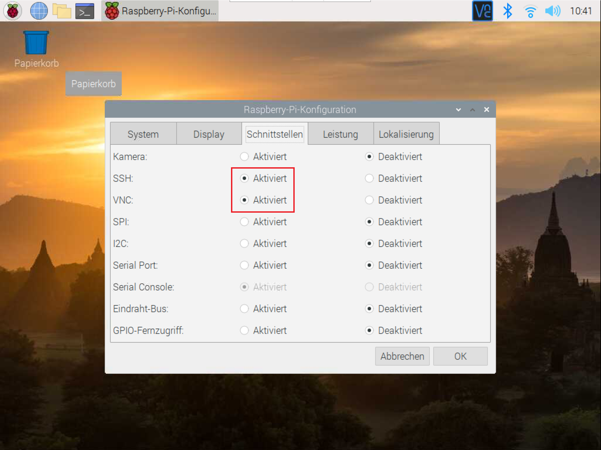
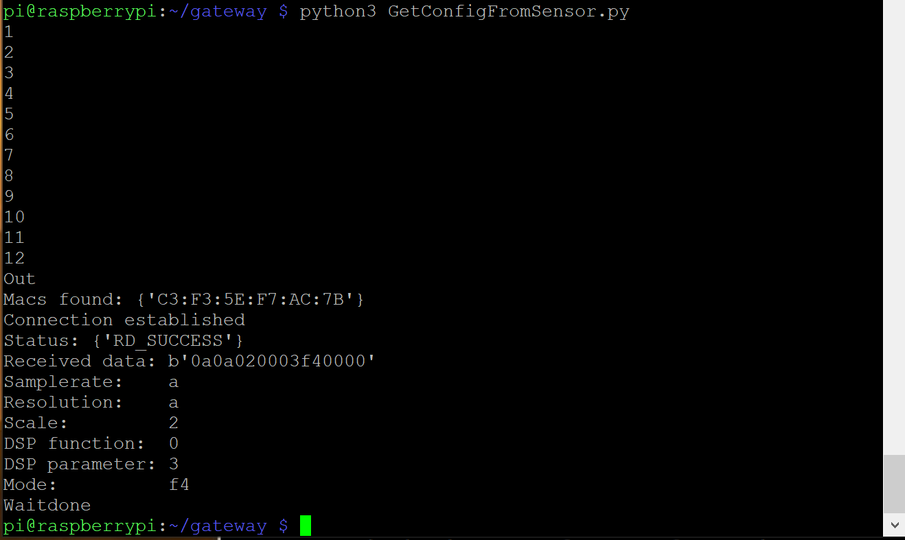

# Getting Started


## Sensor Development Environment

This Chapter is a short guide for setting up your development environment. Until you receive your hardware you can start with installing the necessary software.

### Software Setup

1. Download **Segger Embedded Studio for ARM 5.10d** (https://www.segger.com/downloads/embedded-studio)

2. Download **nRF5_SDK_15.3.0_59ac345.zip** (https://developer.nordicsemi.com/nRF5_SDK/nRF5_SDK_v15.x.x/)

3. Clone https://github.com/bchwtz-fhswf/ruuvi.firmware.c. Copy the extracted ZIP from 2. Inside the cloned folder (If you don’t know how to clone a git repository look at https://git-scm.com/book/en/v2/Git-Basics-Getting-a-Git-Repository.

The final result should look like this:


4. Open SEGGER and click **File** $\rightarrow$ **Open Solution**, navigate to the cloned repository and open `ruuvi.firmware.c`. The project should now be inside SEGGER.

5. Search *Project ‘ruuvitag_b’* on the left inside SEGGER, right-click and choose *Set as Active Project*.

### Hardware Setup

6. Open your ruuvi tag, take PCB & battery out (you can do so with a little screwdriver or by gently pulling on the battery clip)

7.  Remove the battery by pressing it down


8. Connect the “Tag Connector” cable + plug to your ruuvi tag

9. Connect the other side of the tag connector to the Debug in slot on the Nordic SDK

10. Connect your SDK over USB with your PC


11. To test if everything is right, open SEGGER and click **Target** $\rightarrow$ **Connect J-Link**. SEGGER should connect to your SDK

12. To flash your ruuvi tag with the cloned firmware, click **Target** $\rightarrow$ **Erase All**, afterwards click **Build** $\rightarrow$ **Build and Run**. 


### Testing the Gateway Connection

1. Connect your Raspberry Pi to a screen via HDMI.

2. Connect your Raspberry to your WiFi.

3. Activate SSH and VNC by clicking on the raspberry on the top left $\rightarrow$ **Preferences** $\rightarrow$ **Raspberry-Pi-Configuration** $\rightarrow$ **Interfaces**, change SSH and VNC to activated.





4. On your PC, download PuTTY (https://www.putty.org/)

5. Get your Raspberry’s IP-Adress by opening a command line on your PC and and type:

```{bash, eval=F}
ping raspberrypi.local
```

6. Open PuTTY, type the IP-Adress into the Host Name field. You can save it by entering a name into the “Saved Sessions” field and pressing “save”. Afterwards select “open”.

7. When asked for the username type `pi` and afterwards enter your password. If you did not change it on Raspberry’s startup it should be `raspberry`.

8. To clone the Gateway repository (https://github.com/bchwtz-fhswf/gateway) onto your pi, you need a SSH Key which is connected to your account. Generate it by following the instructions in https://docs.github.com/en/github/authenticating-to-github/generating-a-new-ssh-key-and-adding-it-to-the-ssh-agent for Linux (you dont have to pass it to a key agent) and add it to your account by following the instructions in https://docs.github.com/en/github/authenticating-to-github/adding-a-new-ssh-key-to-your-github-account 

9. Clone the gateway repository to your raspberry by typing the folowing into the remote console window connected to your raspberry. When asked, enter the SSH Key password you initiated while generating the key.

```{bash, eval=F}
git clone git@github.com:bchwtz-fhswf/gateway.git 
```

10. Before you are able to execute some of the scripts, you have to install some Python modules by typing or pasting the following commands. (You can paste into a PuTTY window by right-clicking) 

```{bash, eval=F}
pip3 install ruuvitag_sensor
pip3 install crcmod
pip3 install pygatt
pip3 install interruptingcow
sudo apt-get install bluez bluez-hcidump
```

11. To try if your setup is working, navigate to the cloned repo and type `python3 GetConfigFromSensor.py`. You should see something like this:


12. To properly use the gateway library, type `python3` into the remote console window. This activates an interactive python session. 

```{python, eval=F}
import SensorGatewayCommunication
test = SensorGatewayCommunication.RuuviTagAccelerometerCommunication()
test.activate_logging_at_sensor()

# Wait a few seconds and type
test.get_last_sample_acceleration_data()

# Wait 2 minutes and type
abc = test.get_acceleration_data() 
```

You should see some x,y and z acceleration data after executing the `get_last_sample_acceleration_data` function. After `get_acceleration_data`, you should see a lot of hex data flooding through your screen. They get saved inside a `*.csv` file for further analysis. 

**CONGRATULATIONS! YOUR SETUP IS READY!!!**

```{bash, eval=F}
# TODO: Add Explanation
sudo apt-get install libatlas-base-dev
sudo apt-get install python3-pandas
sudo apt-get install python3-numpy
```

If you are constanly testing gateway-sensor interactions that it may be more convenient to do so via a webbrowser and not via a SSH remote shell. For this you can install a jupyter hub on the Pi https://towardsdatascience.com/setup-your-home-jupyterhub-on-a-raspberry-pi-7ad32e20eed

## Gateway Development Environment

