# Sensor

The following figure shows the high level architecture of acceleration data logging in Ruuvi Tag. All configuration is done via the gateway. It communicates with the Ruuvi Tag using the Nordic UART interface via GATT messages transported by Bluetooth Low Energy (BLE). Most logic regarding acceleration logging is implemented inside the module [app_accelerometer_logging.c](sensor.html#app_accelerometer_logging.c).


Three use cases are shown in this figure.

## Initializing acceleration logging ##
The initialization is shown with blue arrows and numbers in black circles until #4. 

To activate acceleration logging the gateway sends the [control acceleration logging message](ble-gatt-messages.html#control-acceleration-logging). In general GATT messages are handled by the function [`handle_comms()`](sensor.html#void-handle_comms-const-ri_comm_xfer_fp_t-reply_fp-const-uint8_t-const-raw_message-size_t-data_len) inside the module [app_comm.c](sensor.html#app_comms.c). Messages regarding acceleration logging are delegated to the function [`handle_lis2dh12_comms_v2()`](sensor.html#rd_status_t-handle_lis2dh12_comms_v2-const-ri_comm_xfer_fp_t-reply_fp-const-uint8_t-const-raw_message-size_t-data_len) inside the same module. After receiving the message to activate acceleration logging the function [`app_enable_sensor_logging()`](sensor.html#rd_status_t-app_enable_sensor_loggingconst-bool-use_ram_db-const-bool-format_db) inside the module [app_accelerometer_logging.c](sensor.html#app_accelerometer_logging.c) in called (1).

The first step in activation is to check if all conditions are fulfilled. The function returns an error code if acceleration logging is already active or if it is called on a sensor which does not include an LIS2DH12. This check is done by calling [`find_sensor()`](sensor.html#rt_sensor_ctx_t-app_sensor_find-const-char-name) inside of [app_sensor.c](sensor.html#app_sensor.c) (2). This function returns the sensor context. The sensor context consists of several information about the sensor. The next step associates the function [`on_fifo_full()`](sensor.html#void-on_fifo_full-const-ri_gpio_evt_t-evt) from [app_accelerometer_logging.c](sensor.html#app_accelerometer_logging.c) with the interrupt pin retrieved from the sensor context (3). The last step is to activate FIFO and interrupt generation inside the LIS2DH12. This is done by calling two functions from the sensor context. At last the function pointer to `data_get()` inside the sensor context is replaced by the pointer to the function [`lis2dh12_logged_data_get()`](sensor.html#rd_status_t-lis2dh12_logged_data_get-rd_sensor_data_t-const-data). 

## Retrieving data from FIFO ##
When FIFO is full inside LIS2DH12 the interrupt starts the function [`on_fifo_full()`](sensor.html#void-on_fifo_full-const-ri_gpio_evt_t-evt). This function does not directly handle the new data. It schedules a call to [`fifo_full_handler()`](sensor.html#void-fifo_full_handler-void-p_event_data-uint16_t-event_size). Instead of [`on_fifo_full()`](sensor.html#void-on_fifo_full-const-ri_gpio_evt_t-evt) this is called in the main thread of the application. If processing is done inside a function inside an interrupt context this prevents processing of another interrupt. This should be avoided.

Inside [`fifo_full_handler()`](sensor.html#void-fifo_full_handler-void-p_event_data-uint16_t-event_size) the FIFO from LIS2DH12 is read (5). The values are store in memory in raw format to be ready to present them to the function [`lis2dh12_logged_data_get()`](sensor.html#rd_status_t-lis2dh12_logged_data_get-rd_sensor_data_t-const-data) which is important for heartbeat. In parallel the raw values are compacted by removing all unused bits. This is done by the function [`pack()`](sensor.html#void-packconst-uint8_t-resolution-const-uint16_t-sizedata-const-uint8_t-const-data-uint8_t-const-packeddata). These values are handover to the FlashDB which writes them to flash (6).

## Using the data by heartbeat ##
This use case is shown with magenta arrows and numbers inside magenta circles in the figure above.

The heartbeat retrieves the values from all sensors by calling the function `app_sensor_get()` inside the module [app_sensors.c](sensor.html#app_sensor.c). In the original setup this function calls [`ri_lis2dh12_data_get()`](sensor.html#rd_status_t-ri_lis2dh12_data_get-rd_sensor_data_t-const-data) inside [ruuvi_interface_lis2dh12.c](sensor.html#ruuvi_interface_lis2dh12.c). During initialization this function is replaced by [`lis2dh12_logged_data_get()`](sensor.html#rd_status_t-lis2dh12_logged_data_get-rd_sensor_data_t-const-data).

[`lis2dh12_logged_data_get()`](sensor.html#rd_status_t-lis2dh12_logged_data_get-rd_sensor_data_t-const-data) retrieves the raw acceleration values from memory. Then the values are parsed by calling [`ri_lis2dh12_raw_data_parse()`](sensor.html#rd_status_t-ri_lis2dh12_raw_data_parse-rd_sensor_data_t-const-data-axis3bit16_t-raw_acceleration-uint8_t-raw_temperature) and returned to the heartbeat.

## Initialization during boot ##
All sensor initialization is done inside [`setup()`](sensor.html#void-setup-void) from [main.c](sensor.html#main.c). This function calls [`app_acc_logging_init()`](sensor.html#rd_status_t-app_acc_logging_initvoid) inside [app_accelerometer_logging.c](sensor.html#app_accelerometer_logging.c). The function checks if the ringbuffer exists. If this is true it activates acceleration logging as described earlier.

## Streaming of acceleration data ##

In case of sampling acceleration data at high sampling frequencies than storing them in flash memory may be not possible because of latency of the memory or limitations by available size of memory. As an alternative the data can be streamed. In this mode, data from the acceleration sensor will not be written to flash. Instead the data is cached in RAM. For this purpose 6k RAM are dynamically allocated using `malloc()` during enabling of streaming. At the time of writing this documentation FlashDB lacks the feature of freeing memory which is used to store a database. Because of this missing feature the only way of freeing the memory used by streaming is to reboot the firmware.

The following figure shows the difference between logging of acceleration data and streaming.

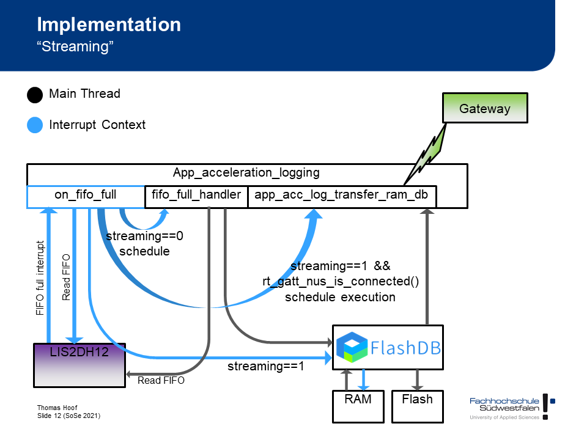
When logging is active, the acceleration sensor LIS2DH12 generated an interrupt every time its FIFO is full. The interrupt causes the execution of [`on_fifo_full()`](sensor.html#void-on_fifo_full-const-ri_gpio_evt_t-evt). This function schedules the execution of [`fifo_full_handler()`](sensor.html#void-fifo_full_handler-void-p_event_data-uint16_t-event_size) outside interrupt context (grey). The following process was described [earlier](sensor.html#retrieving-data-from-fifo).

When streaming is active, the process is started by the same condition. But the FIFO is read by [`on_fifo_full()`](sensor.html#void-on_fifo_full-const-ri_gpio_evt_t-evt). Instead of scheduling [`fifo_full_handler()`](sensor.html#void-fifo_full_handler-void-p_event_data-uint16_t-event_size) the function hands over the data to FlashDB which stores them in RAM. This is done inside interrupt context (blue). In case of streaming there is no explicit command to read the data by the gateway. Instead, if connected to Bluetooth GATT service, the data is automatically send. This is done by scheduling [`app_acc_log_transfer_ram_db()`](sensor.html#void-app_acc_log_transfer_ram_db-void-p_event_data-uint16_t-event_size). [`on_fifo_full()`](sensor.html#void-on_fifo_full-const-ri_gpio_evt_t-evt) schedules execution of this function if `rt_gatt_nus_is_connected()` returns true.

## Saving the config inside the flashdb ##

To be able to report different sensor-config versions to the gateway, at different times, the current config is stored in the key-value-partition of the flashdb.
The configuration can be accessed via `rt_sensor_get_from_fdb` defined in [ruuvi_task_sensor.c](sensor.html#ruuvi_task_sensor.c).
The values will then be automatically loaded onto the sensor struct.
To save a config you will have to use `rt_sensor_store_to_fdb` defined in [ruuvi_task_sensor.c](sensor.html#ruuvi_task_sensor.c).

## Heartbeat ##
The heartbeat is an interval in which the sensor communicates via Bluetooth to the outside world. One of the most important facts about the heartbeat is that this is the only point in time a device can connect to the sensor. The default interval is around 800ms. However, the heartbeat can be get and set on sensor site with static methods `get_current_heartbeat()` and `app_heartbeat_start(uint16_t heartbeat_ms)` defined in [app_heartbeat.c](sensor.html#app_heartbeat.c).
Once the heartbeat is modified by hand (either from the sensor itself or from outside via Bluetooth messages) the new value is stored and will be applied directly and on every following reboot. Therefore it is advisable to be careful with modifying the heartbeat. 

## Implementation ##

### app_heartbeat.c ###

#### `uint16_t get_current_heartbeat(void)` ####

Get the current heartbeat.

#### `rd_status_t app_heartbeat_stop(void)` ####

Stop the heartbeat.
Note: This method should always be called before `app_heartbeat_start()` is called.


#### `rd_status_t app_heartbeat_start(uint16_t heartbeat_ms)` ####

Start and store the heartbeat with the new interval.

| Parameters |||
| - | - | - |
| heartbeat_ms | in | New interval for heartbeat in milliseconds. |

### ruuvi_task_sensor.c ###
#### `rd_status_t rt_sensor_get_from_fdb(fdb_kvdb_t kvdb, rt_sensor_ctx_t *sensor)` ####

Retrieves data from fdb-kv-partition and loads it onto the sensor struct.

#### `rd_status_t rt_sensor_store_to_fdb(fdb_kvdb_t kvdb, rt_sensor_ctx_t *sensor)` ####

Stores data from the sensor-struct to the kvdb, referencing the current timestamp.


### app_accelerometer_logging.c ###

#### `rd_status_t app_enable_sensor_logging(const bool use_ram_db, const bool format_db)` ####

Enables the logging of acceleration data.

| Parameters |||
| - | - | - |
| use_ram_db | in | Database in RAM is used in case of streaming of acceleration data. |
| format_db | in | This parameter is set to true if logging is enabled by gateway to ensure the database is cleared. When re-enabling logging after reboot it is set to false. |

| Special error codes |||
| - | - | - |
| RD_ERROR_INVALID_STATE | If logging is already enabled. |
| RD_ERROR_NOT_FOUND | If LIS2DH12 is not available. |

#### `rd_status_t app_disable_sensor_logging(void)` ####

Disables the logging of acceleration data.

| Special error codes ||
| - | - |
| RD_ERROR_INVALID_STATE | If logging is already disabled. |
| RD_ERROR_NOT_FOUND | If LIS2DH12 is not available. |

#### `void on_fifo_full (const ri_gpio_evt_t evt)` ####

Callback function when FIFO full interrupt occurs at LIS2DH12. If using streaming this function reads the FIFO and writes the values to RAMDB. 

Without streaming it schedules the execution of [`void fifo_full_handler (void * p_event_data, uint16_t event_size)`](sensor.html#void-fifo_full_handler-void-p_event_data-uint16_t-event_size) to read the FIFO outside interrupt context. See ruuvi_interface_scheduler.h for parameters used in this function.

#### `void fifo_full_handler (void * p_event_data, uint16_t event_size)` ####

This function reads the FIFO and stores the data inside the timeseries database. See ruuvi_interface_scheduler.h for parameters used in this function.

#### `void pack(const uint8_t resolution, const uint16_t sizeData, const uint8_t* const data, uint8_t* const packeddata)` ####

This function stores raw accelerometer values in 8/10/12 Bit format in compact form (without unused bits). It is a frontend to the functions pack8/10/12().

| Parameters |||
| - | - | - |
| resolution | in | Resolution of the samples. |
| sizeData | in | Size of input data. |
| data | in | Input data. |
| packeddata | in/out | Memory for storing compacted data. |

#### `rd_status_t lis2dh12_logged_data_get (rd_sensor_data_t * const data)` ####

This function retrieves raw accelerometer values from memory. The values are parsed and returned inside data. It is called by `app_sensor_get()` inside [app_sensor.c](sensor.html#app_sensor.c) if accelerometer logging is active.

| Parameters |||
| - | - | - |
| raw_data | in/out | Memory for storing accelerometer values. |

#### `rd_status_t app_acc_logging_send_eof_v2(const ri_comm_xfer_fp_t reply_fp, const rd_status_t status_code, const uint16_t crc)` ####

This function is called by [`app_acc_logging_send_logged_data()`](sensor.html#rd_status_t-app_acc_logging_send_logged_dataconst-ri_comm_xfer_fp_t-reply_fp-const-bool-is_v2) after all data is sent to the requestor. This function builds the [end of data message](ble-gatt-messages.html#end-of-data-message) and sends it.

| Parameters |||
| - | - | - |
| reply_fp | in | Function pointer to reply function. |
| status_code | in | Status code of the whole operation. This code is sent to the requestor. |
| crc | in | CRC value of the data. |

#### `rd_status_t app_acc_logging_send_logged_data(const ri_comm_xfer_fp_t reply_fp)` ####

This function is called when a request to send the logged acceleration data is received by GATT/UART. The function triggers FlashDB to read data. Data from the database is read via the callback function [`callback_send_data_block()`](sensor.html#bool-callback_send_data_blockfdb_tsl_t-tsl-void-arg). Inside the callback function the data is send to the requestor.

| Parameters |||
| - | - | - |
| reply_fp | in | Function pointer to reply function. |

| Special error codes ||
| - | - |
| RD_ERROR_INVALID_STATE | If logging is not active. |

#### `rd_status_t app_acc_logging_state(void)` ####

This function is used to query the state of accelerometer logging. It is called when a control message is received by GATT/UART to return this state to the caller. If streaming is active, this will not be reported as active logging by this function.

| Special error codes ||
| - | - |
| RD_SUCCESS | If logging is active. |
| RD_ERROR_INVALID_STATE | If logging is not active. |

#### `rd_status_t app_acc_logging_configuration_set (rt_sensor_ctx_t* sensor, rd_sensor_configuration_t* new_config)` ####

This function is called when a request to update the sensor configuration is received by GATT/UART. It checks every configuration parameter if it should be changed. It also checks if the value is different than actual value. If a change is detected it clears the ringbuffer, updates the configuration and stores the configuration in flash.

| Parameters |||
| - | - | - |
| sensor | in | Sensor context of the sensor which configuration should be changed. |
| new_config | in | Structure containing the new configuration values. |

#### `rd_status_t app_acc_logging_init(void)` ####

Initialize acceleration logging during boot. If logging was active before reboot it will be activated. If logging was not active before reboot this function return `RD_SUCCESS` without activating acceleration logging.

This function is called from [`setup()`](sensor.html#void-setup-void).

#### `rd_status_t app_acc_logging_uninit(void)` ####

The uninitialization of acceleration logging disables the logging if it is actually active. If logging is not active this function return RD_SUCCESS without doing anything.

#### `void app_acc_log_transfer_ram_db (void * p_event_data, uint16_t event_size)` ####

Execution of this function is scheduled if “streaming” is active and `rt_gatt_nus_is_connected()` returns true. It starts reading currently logged data from the FlashDB and transferring the data to the gateway.

Scheduling of this function is done inside [`on_fifo_full()`](sensor.html#void-on_fifo_full-const-ri_gpio_evt_t-evt) using `ri_scheduler_event_put()`.

#### `int64_t fdb_timestamp_get (void)` ####

Callback for use by FlashDB to retrieve the timestamp of the current new entry.

#### `bool callback_send_data_block(fdb_tsl_t tsl, void *arg)` ####

Callback function for use with FlashDB. When reading the database this function will be called for every entry.

This function calls `app_comms_blocking_send()` to send the data to the gateway.

| Parameters |||
| - | - | - |
| tsl | in | Pointer to current entry in the database. |
| arg | in/out | Pointer to context. See following table. The array consists of the following elements. |

| Context parameters by `*arg` |||
| - | - | - |
| `((void**)arg)[0]` | in | Pointer to database of type `fdb_tsdb*`. |
| `((void**)arg)[1]` | in | Pointer to transfer function `app_comms_blocking_send()`. |
| `((void**)arg)[2]` | in/out | Pointer to CRC value. |

If this functions returns `true` iterating over the following entries will by aborted.

#### `rd_status_t app_acc_logging_statistic (uint8_t* const statistic)` ####

This function is called from `handle_lis2dh12_comms()` after the gateway sends the message to retrieve flash statistics.

| Parameters |||
| - | - | - |
| statistic | in/out | Memory to store the statistic values. |

#### `uint8_t ruuvi_error_code_to_uint8(rd_status_t err_code)` ####

This function converts an Ruuvi error code to a one byte value. It returns the bit index of first error it finds. It cannot return a set of multiple errors as the input value supports.

| Parameters |||
| - | - | - |
| err_code | in | Ruuvi error code. |


### app_comms.c ####

#### `void handle_comms (const ri_comm_xfer_fp_t reply_fp, const uint8_t * const raw_message, size_t data_len)` ####

Added new switch/case which forwards messages regarding configuration and control of acceleration logging to the function [`handle_lis2dh12_comms()`](sensor.html#rd_status_t-handle_lis2dh12_comms-const-ri_comm_xfer_fp_t-reply_fp-const-uint8_t-const-raw_message-size_t-data_len), [`handle_lis2dh12_comms_v2()`](sensor.html#rd_status_t-handle_lis2dh12_comms_v2-const-ri_comm_xfer_fp_t-reply_fp-const-uint8_t-const-raw_message-size_t-data_len), [`handle_rtc_comms()`](sensor.html#rd_status_t-handle_rtc_comms-const-ri_comm_xfer_fp_t-reply_fp-const-uint8_t-const-raw_message-size_t-data_len).

#### `rd_status_t handle_lis2dh12_comms (const ri_comm_xfer_fp_t reply_fp, const uint8_t * const raw_message, size_t data_len)` ####

This function handles messages using the proprietary message format by GATT/UART communication needed to control the functionality of acceleration logging.

| Parameters |||
| - | - | - |
| reply_fp | in | Function pointer to reply function. |
| raw_message | in | Message received. |
| data_len | in | Length of the received message. |

| Special error codes ||
| - | - |
| RD_ERROR_NOT_FOUND | If LIS2DH12 is not found. |
| RD_ERROR_INVALID_PARAM | If unknown or invalid message was received. |

#### `rd_status_t handle_lis2dh12_comms_v2 (const ri_comm_xfer_fp_t reply_fp, const uint8_t * const raw_message, size_t data_len)` ####

This function handles messages using version 2 message format by GATT/UART communication needed to control the functionality of acceleration logging.

| Parameters |||
| - | - | - |
| reply_fp | in | Function pointer to reply function. |
| raw_message | in | Message received. |
| data_len | in | Length of the received message. |

| Special error codes ||
| - | - |
| RD_ERROR_NOT_FOUND | If LIS2DH12 is not found. |
| RD_ERROR_INVALID_PARAM | If unknown or invalid message was received. |

#### `rd_status_t handle_rtc_comms (const ri_comm_xfer_fp_t reply_fp, const uint8_t * const raw_message, size_t data_len)` ####

This function handles messages using version 2 message format by GATT/UART communication needed to control the RTC clock.

| Parameters |||
| - | - | - |
| reply_fp | in | Function pointer to reply function. |
| raw_message | in | Message received. |
| data_len | in | Length of the received message. |

| Special error codes ||
| - | - |
| RD_ERROR_INVALID_PARAM | If unknown or invalid message was received. |

#### `rd_status_t dis_init (ri_comm_dis_init_t * const p_dis, const bool secure)` ####

This function is called during initialization of the Bluetooth protocol stack. 

Our extension to this function is executed if `app_sensor_ctx_get()` from app_sensors.c is available. It sets the hardware revision string inside `ri_comm_dis_init_t` to the list of available and initialized sensors.

### ruuvi_nrf5_sdk15_communication_ble_gatt.c ###

#### `rd_status_t ri_gatt_dis_init (const ri_comm_dis_init_t * const p_dis)` ####

This function is called during initialization of the Bluetooth protocol stack. Our extension to this function adds a buildnumber to the former unused property `sw_rev_str` of `ble_dis_init_t`. The buildnumber is generated by a pre-build script `buildnum.js` which is executed by Segger Embedded Studio before compiling the software. The pre-buold script generated `buildnum.h` which includes the buildnumber.

### app_config.h ###

- Added macro APP_SENSOR_LOGGING to control compilation of app_accelerometer_logging.*
- If APP_SENSOR_LOGGING is not defined or is defined as 0 the functionality of logging of acceleration data is not available in the application.
- Changed the definition of APP_FLASH_PAGES to include the flash pages used for acceleration logging.
- This module also contains macros for memory separation between acceleration logging and environmental logging. The relevant macros are APP_FLASH_LOG_DATA_RECORDS_NUM and RT_FLASH_RINGBUFFER_MAXSIZE.

### app_sensor.c ###

#### `rt_sensor_ctx_t* app_sensor_find (const char *name)` ####

Find sensor by its name. Works only with initialized sensors, will not return a sensor which is supported in firmware but not initialized.

This function is called by [`app_enable_sensor_logging()`](sensor.html#rd_status_t-app_enable_sensor_loggingvoid) and [`app_disable_sensor_logging()`](sensor.html#rd_status_t-app_disable_sensor_loggingvoid) to retrieve the sensor context.

| Parameters |||
| - | - | - |
| name | in | Name of the sensor. |

### main.c ###

#### `void setup (void)`  ####

Added call to [`app_acc_logging_init()`](sensor.html#rd_status_t-app_acc_logging_initvoid) to initialize acceleration logging.

### ruuvi_interface_lis2dh12.c ###

#### `rd_status_t ri_lis2dh12_acceleration_raw_get (uint8_t * const raw_data)` ####

This function reads raw acceleration values from the registers of LIS2DH12. It is called from the [interrupt handler](sensor.html#void-fifo_full_handler-void-p_event_data-uint16_t-event_size) inside [app_accelerometer_logging.c](sensor.html#app_accelerometer_logging.c) and from [`ri_lis2dh12_data_get()`](sensor.html#rd_status_t-ri_lis2dh12_data_get-rd_sensor_data_t-const-data).

| Parameters |||
| - | - | - |
| raw_data | in/out | Memory for storing raw accelerometer values. |

#### `rd_status_t ri_lis2dh12_temperature_raw_get (uint8_t * const raw_temperature)` ####

This function reads raw temperature value from the registers of LIS2DH12. It is called  [`ri_lis2dh12_data_get()`](sensor.html#rd_status_t-ri_lis2dh12_data_get-rd_sensor_data_t-const-data) and [`lis2dh12_logged_data_get()`](sensor.html#rd_status_t-lis2dh12_logged_data_get-rd_sensor_data_t-const-data).

| Parameters |||
| - | - | - |
| raw_temperature | in/out | Memory for storing raw temperature values. |

#### `rd_status_t ri_lis2dh12_data_get (rd_sensor_data_t * const data)` ####

The original function `ri_lis2dh12_data_get()` is split into retrieving raw values from the sensor and parsing these data. Parsing is done by [`ri_lis2dh12_raw_data_parse()`](sensor.html#rd_status_t-ri_lis2dh12_raw_data_parse-rd_sensor_data_t-const-data-axis3bit16_t-raw_acceleration-uint8_t-raw_temperature).

This function is used if the acceleration logging is not active. If acceleration logging is active this function is replaced by [`lis2dh12_logged_data_get()`](sensor.html#rd_status_t-lis2dh12_logged_data_get-rd_sensor_data_t-const-data).

| Parameters |||
| - | - | - |
| data | in/out | Structure for storing parsed accelerometer values. |

#### `rd_status_t ri_lis2dh12_raw_data_parse (rd_sensor_data_t * const data, axis3bit16_t *raw_acceleration, uint8_t *raw_temperature)` ####

This function parses raw values from the sensor and stores the values inside data. It is called from [`ri_lis2dh12_data_get()`](sensor.html#rd_status_t-ri_lis2dh12_data_get-rd_sensor_data_t-const-data) and from [`lis2dh12_logged_data_get()`](sensor.html#rd_status_t-lis2dh12_logged_data_get-rd_sensor_data_t-const-data).

| Parameters |||
| - | - | - |
| data | in/out | Structure for storing parsed accelerometer values. |
| raw_acceleration | in | Raw acceleration values. |
| raw_temperature | in | Raw temperature value. This parameter can be NULL. |

### ruuvi_nrf5_sdk_rtc_mcu.c ###

#### `rd_status_t ri_set_rtc_millis(uint64_t millis)` ####

Set system time by external source. Set RTC to zero.

| Parameters |||
| - | - | - |
| millis | in | External time. |

### ruuvi_nrf5_sdk15_power.c / ruuvi_nrf5_sdk15_power.h ###

#### `rd_status_t ri_power_read_boot_count (uint32_t *boot_count)` ####

This function return the boot counter.

| Parameters |||
| - | - | - |
| boot_count | out | Memory for storing the boot counter. |

### ruuvi_task_flash_ringbuffer.c ###

The ringbuffer module acts as a frontend to FlashDB. The ringbuffer functionality is provided by the timeseries database of FlashDB.

#### `rd_status_t rt_flash_ringbuffer_create(const char *partition, fdb_get_time get_time, const bool format_db)` ####

This function initializes an instance of timeseries database. 

| Parameters |||
| - | - | - |
| partition | in | Name of the partition of the FAL device where the database will be stored. |
| get_time | in | Function pointer to callback function. This function is used by timeseries database to retrieve the current timestamp. |
| format_db | in | Wether to force to create a empty database. |

#### `rd_status_t rt_flash_ringbuffer_write(const uint16_t size, const void* data)` ####

 This function writes data to FlashDB.

| Parameters |||
| - | - | - |
| size | in | Size of data |
| data | in | Data to be written  |

#### `rd_status_t rt_flash_ringbuffer_read(const fdb_tsl_cb callback, const ri_comm_xfer_fp_t reply_fp, uint16_t* crc)` ####

This function starts reading the timeseries database. Reading data from timeseries database is done by iterating all entries. For every entry a callback function is called.

| Parameters |||
| - | - | - |
| callback | in | Callback function which would be called for every entry. |
| reply_fp | in | Callback function which sends the data to the requestor. |
| crc | in/out | CRC16 value which gets calculated over all data send to the requestor. |

#### `rd_status_t rt_flash_ringbuffer_clear(void)` ####

This function clears the contents of the timeseries database. 

#### `rd_status_t rt_flash_ringbuffer_drop (void)` ####

This function de-initializes the timeseries database.

#### `rd_status_t rt_flash_ringbuffer_statistic (uint8_t* const statistic)` ####

This function reads some statistics about the usage of the internal Nordic Flash memory and returns them.

| Parameters |||
| - | - | - |
| statistic | in/out | Memory for storing statistics. |


### ruuvi_task_flashdb.c ###

This module contains supporting functions needed to integrate FlashDB into Ruuvi Firmware.

#### `rd_status_t rt_macronix_flash_exists(void)` ####

This function checks if Macronix Flash Chip is available.

| Special error codes ||
| - | - |
| RD_SUCCESS | If Macronix Flash is available. |
| RD_ERROR_NOT_FOUND | If Macronix Flash is not available. |
| RD_ERROR_NOT_INITIALIZED | If the module is currently not initialzed. |

#### `rd_status_t rt_flashdb_to_ruuvi_error(fdb_err_t fdb_err)` ####

This function converts an error code of FlashDB to an Ruuvi error code. It return the Ruuvi error code which represents the state of FlashDB.

| Parameters |||
| - | - | - |
| fdb_err | in | Error code of FlashDB. |

#### `rd_status_t rt_reset_macronix_flash(void)` ####

This functions sends the Chip Erase command to the macronix flash chip if the chip is available. This function is called during factory reset.

#### `rt_macronix_high_performance_switch(const bool enable)` ####

This function configures the high performance switch of the Macronix Flash Chip. High performance mode is used during formating the flash in order to prepare it for the database or during factory reset. 

| Parameters |||
| - | - | - |
| enable | in | Desired mode of operation. |

#### `void fdb_log (const char * const msg, ...)` ####

This function acts as a proxy between the logging mechanism of FlashDB and the log writing system of Ruvvi. It converts the parameters and passes log messages to Ruuvi's logging module.

### app_button.c ###

#### `void factory_reset (void * p_event_data, uint16_t event_size)` ####

Add call to [`rt_reset_macronix_flash()`](sensor.html#rd_status_t-rt_reset_macronix_flashvoid) to delete content of Macronix Flash in case of factory reset.


## Energy consumption ##
The following figure visualizes energy consumption of different operation states. The numbers at the measuring point are equal to the duration. All measurements are done with 3V supply voltage.

 ```{r echo=FALSE}
 energymeasurement <- openxlsx::read.xlsx("Energiemessung.xlsx", sheet="Tabelle1")

 energymeasurement <- tibble::as_tibble(energymeasurement)

 energymeasurement <- energymeasurement %>% dplyr::rename(action=Aktion,
 flash=Flash,
 resolution_bit="Resolution./.Bit",
 samplingrate_hz="Samplingrate./.Hz",
 duration_s="Dauer./.s",
 voltage_v="Spannung./.V",
 current_uA="Average.Current./.µA",
 energy_mJ="Energie./.mJ")

 energymeasurement %>% ggplot2::ggplot() +
 ggplot2::aes(x=samplingrate_hz, y=energy_mJ, color=flash) +
 ggplot2::geom_path() +
 ggplot2::geom_point(ggplot2::aes(shape=action), size=3) +
 ggplot2::geom_text(ggplot2::aes(label=duration_s), nudge_y=70, color="black") +
 ggplot2::theme_bw() +
 ggplot2::scale_y_continuous(name="energy / mJ", sec.axis=ggplot2::sec_axis(trans=~./3, name="charge / mC")) +
 ggplot2::xlab("samplingrate / Hz")
 ```

## Firmware packaging ##

To create a File which is suitable for [DFU](https://ruuvi.com/software-update/) you need [nrfutil](https://www.nordicsemi.com/Products/Development-tools/nRF-Util) from Nordic Semiconductor. The DFU Package must be signed. The [private key](https://github.com/ruuvi/ruuvi.nrf5_sdk15_bootloader.c/blob/master/ruuvi_open_private.pem) can be obtained from Ruuvi's Github repository.

The following script to create a DFU package assumes this directory structure.
```
dfu-package
 \
  | ruuvi_open_private.pem
ruuvi.firmware.c
 \
  | nRF5_SDK_15.3.0_59ac345
  | src
  | \
  |  | output
  |  | \
  |  |  | debug
  |  |  | \
  |  |  |  | exe
```

To create a DFU package execute the following commands inside directory dfu-package.
```
nrfutil settings generate --family NRF52 --application ..\ruuvi.firmware.c\src\Output\Debug\Exe\ruuvitag_b.hex --application-version 1  --bootloader-version 1 --bl-settings-version 1 output\settings.hex
mergehex -m ..\ruuvi.firmware.c\nRF5_SDK_15.3.0_59ac345\components\softdevice\s132\hex\s132_nrf52_6.1.1_softdevice.hex ruuvitag_b_s132_6.1.1_bootloader_3.1.0.hex output\settings.hex -o output\sbc.hex
mergehex -m output\sbc.hex ..\ruuvi.firmware.c\src\Output\Debug\Exe\ruuvitag_b.hex -o output\packet.hex
nrfutil pkg generate --application ..\ruuvi.firmware.c\src\Output\Debug\Exe\ruuvitag_b.hex --application-version 1 --hw-version 0xB0 --sd-req 0xB7 --key-file ruuvi_open_private.pem dfu_app.zip
```

# External Flash Integration
In this chapter the software architecture for implementing an external flash is described. The ruuvi sensor includes an internal flash with 56 Kbyte. To show the benefit of an external flash, the following example analyzes how long data can be recorded in each case. Using the internal FIFO that has storage space for 32 acceleration data samples and a configuration of:  

 * 10 Hz frequency  
 * 12 bit of data resolution  

144Byte of data are written to the internal flash every 3,2s. That allows logging data for 1244 s.  
Implementing the external flash from Macronix with a size of 64Mbit and the same configuration as above allows logging for 51,756 h.  

## Macronix Flash ##
Next, an overview on general parameters of the Macronix flash is given. The MX25R6435F is a serial NOR flash with 64Mbits. It promises a minimum of 100.000 erase/program cycles and 20 years of data retention.  
Further, the flash has a status register that indicates its status and a configuration register which can change the default status of the chip. Program commands can be executed on byte, page (256 bytes), or word basis while erase commands can be executed on sector (4K-byte), block (32K-byte), block (64K-byte) or whole chip basis.  
For testing the “tag connector” is used where the following pins are defined for the SPI bus:  

| SPI | PIN |
| - | - |  
| MOSI | 30 |  
| MISO | 31 |  
| SCK | 20 |  
| SS | 16 |  

When the external flash is included on the PCB, the pins for the SPI bus must change to:  

| SPI | PIN |  
| - | - |  
| MOSI | 23 |  
| MISO | 22 |  
| SCK | 24 |  
| SS | 11 |  

The following picture showes the setup:  
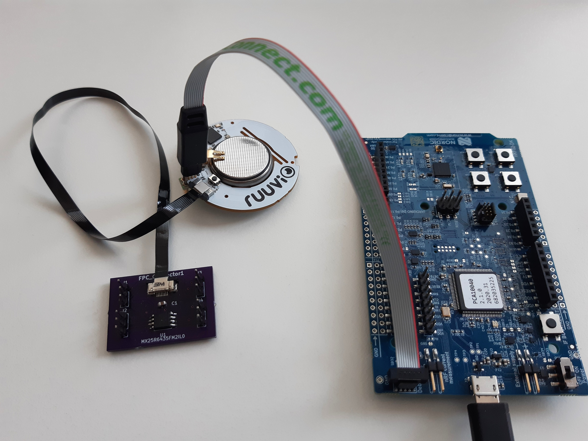  

## Database vs. Filesystem ##
For data management on the flash, a database is needed. An alternative is, to use a file system. For the decision, the following characteristics of each option are considered:  

| Database | Filesystem |  
| - | - |  
| Related, structured data | Good with unstructured data |  
| Data with defined formats | Small overhead |  
| Efficient for insert, update and/or retrieval |  |  

As a first approach, the database FlashDB is used. The acceleration data is structured, the order of the incoming data and its timestamp is of interest. That is provided by the time series data base (TSDB). Another useful functionality is the key value data base (KVDB), supported by the FlashDB, that allows storing the configuration. Also, the KVDB provides efficient storage of pre-processed data, which is a possible requirement in future.  


### FlashDB 
“Flash DB is an ultra-lightweight embedded database that focuses on providing data storage solutions for embedded products.” [https://github.com/armink/FlashDB] The DB promotes with a strong performance and reliability including a Power-off protection function and wear balance to extend Flash life. It ensures extremely low resource occupation, ram usage of almost 0 and a very small footprint. Also, multiple partitions and multiple instances are supported. The FlashDB uses sectors which are the smallest unit for formatting. As mentioned above, there are two database modes:  

**Key-value** database  

 * Non-relational database  
 * Stores data as a collection of key-value pairs, with key as unique identifier  
 * Supports two KV types: string and blob  

**Time Series** database  

 * Stores data in time sequence with timestamp  
 * Has large amount of data storage and high insertion and query performance.  

Reference: [FlashDB by armink](https://github.com/armink/FlashDB)  

## Implementation ##
The following chapter is focusing on the software structure, modules and functions successfully utilized to implement the possibility to store data on the external flash by using the database FlashDB.  
The following figure shows the general structure:  
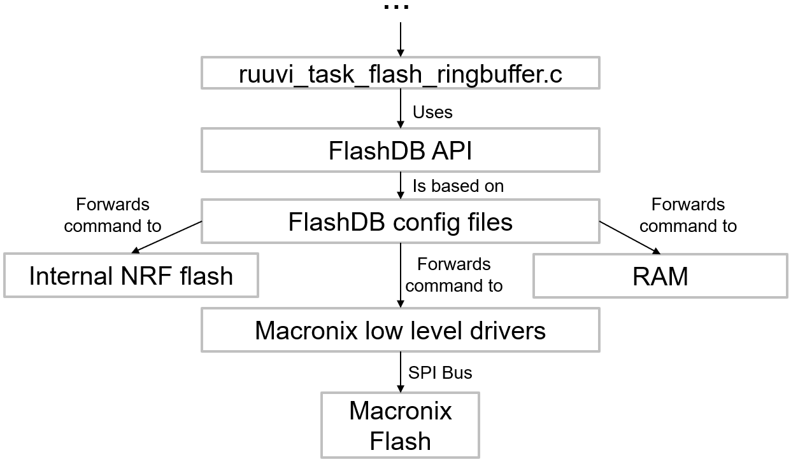
The data collected by the acceleration sensor are passed through several instances and finally end in the module “ruuvi_task_flash_ringbuffer.c” which is responsible for organizing the storage of the collected data through usage of the [API offered by FlashDB](#flashdb-api). FlashDB itself needs some configuration, stored inside its config files, to be able to communicate with the different memory devices. Currently, FlashDB can be operated with three different target memories:   
1.	The internal NRF flash in case the external flash is not present, which gets checked at boot-up  
2.	The external flash to allow maximized data storage  
3.	The RAM to allow direct forwarding of acceleration data to the gateway in the use case of streaming (deprecated)  
As this chapter is discusses the integration of the external Macronix flash chip, the other two devices won’t be considered from here on.  
For FlashDB to be able to access the external flash, an interface to the low-level driver functions is implemented, which forwards the necessary control parameters to the actual driver functions, which communicate with the flash device via SPI bus.  

### FlashDB API ###
To administrate the storage independent from the used memory device and from a high-level view, the FlashDB API offers the following functions:  

1.	TSDB:  
* Initialise  
* Control `void fdb_tsdb_control(fdb_tsdb_t db, int cmd, void *arg)`
   Command control words e.g., Set / Get sector size, Set/ Get lock function, Get the timestamp when TSL was last appended  
* Append new TSL  
* Iterative – goes through TSDB, iterative callbacks  
* Query between timestamps  
* Set TSL status  
* Clear TSDB  
* Convert TSL to blob objects  

2.	KVDB:  
* Initialise  
* Control `void fdb_kvdb_control(fdb_kvdb_t db, int cmd, void *arg)  `
   Command control words: Set / Get sector size, Set/ Get lock function  
* Set KV (add a new KV or modify existing KV)  
  + Set blob type KV, Set string type KV  
* Get KV  
  + Get blob type KV, Get KV object, Get string type KV  
* Initialize KV iterator, Iteration  
* Delete KV, Reset KV to default  
* Convert KV to blob objects  
 
For more details: [FlashDB API](https://armink.github.io/FlashDB/#/api)  

### Data Base config files ###  
The FlashDB config files are stored in \ruuvi.firmware.c\src\ruuvi.libraries.c\src\libs\flashdb. They implement the necessary configuration to be able to access the different storage modules.  

####	fal_cfg.h ####   
The fal_cfg file defines the available storage partitions to be used by FlashDB inside the FAL_PART_TABLE. The following figure shows the currently defined partitions and their size, once again stressing the huge amount of more available space when using the external flash in contrast to the internal NRF memory.  
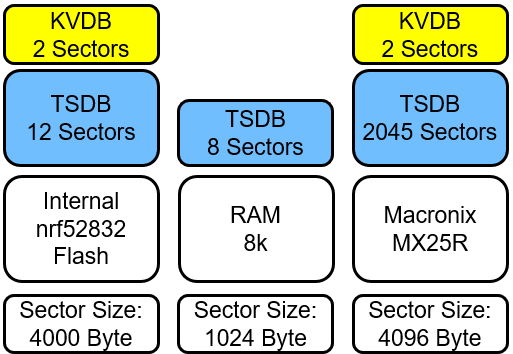  
The small partitions for storing data in the KV format are used for the current sensor configuration while the larger TSDB partitions are utilized to store the acceleration data.  

#### fal_macronix_flash_port.c ####
For each of the available memory devices, a flash_port file is defined, which implements the configuration of the device as well as the interface to the low-level driver functions. In the following, the necessary implementations for the external Macronix flash chip are described:  

##### `Const struct fal_flash_dev macronix_flash0` #####
Defines macronix flash properties for FlashDB  
1. Name (macronixflash0)  
2. Offset Address (0x000000)  
3. Memory size (2047*4096 Bytes = 8MB)  
4. Block size (4096 Bytes)  
5. Write granularity (0 --> not used)  
6. Available operations (init, read, write, erase)  

##### `Static int init(void)` #####
Calls the mx_init() initialization function.   
Returns the status of the initialization function.  

##### `Static int read(long offset, uint8_t *buf, size_t size)` #####
Forwards address (offset), the address of the target data buffer (*buf) and the amount of data 	to be read (size) to the according low-level driver function.  
Returns the read size if successful and –1 if an error occurred.  

##### `Static int write (long offset, const uint8_t *buf, size_t size)` #####
Ensures that the flash device is ready for data transfer, by calling write enable, checking if 	write enable was set properly and checking the status register if the flash is still busy.  
Also splits the data in multiple separate low-level write function calls if the data is separated 	over multiple flash pages as the Macronix flash is not supporting writing over page borders.  
Returns written size if successful, -1 if an error occurred.  

##### `Static int erase (long offset, size_t size)` #####
Ensures that the flash device is ready for data transfer, by calling write enable, checking if write enable was set properly and checking the status register if the flash is still busy.  
Forwards address to "macronix sector erase" low-level driver function.  
--> Database only deletes complete sectors at once  
Returns written size if successful, -1 if an error occurred.  

### Macronix low level driver functions ###
The module “maconix_flash.c/macronix_flash.h” located at \ruuvi.firmware.c\src\ruuvi.drivers.c\macronix implements all low-level driver and helper functions necessary to interact with the Macronix flash chip.  

#### `rd_status_t mx_init(void)` ####   
Checks if SPI bus for macronix flash is already initialized  
If not, defines  
* MOSI, MISO, CLK and SS PINs  
* Frequency, SPI mode and bit order  
Sets all defined SS-PINs as high (not active)  
Definition of SPI-Pins can be changed in macronix_flash.h.  
Returns status code of executed functions, RD_ERROR_INVALID_STATE if bus is already initialized  

#### `rd_status_t mx_read_rems(uint8_t *manufacturer_id, uint8_t *device_id)` ####  
Reads electronic manufacturer & device ID by  
1. Setting SS LOW  
2. Transferring the command "0x90" via SPI  
3. Receiving the answer  
4. Setting SS HIGH  
5. Assigning the values to the received memory  
Is used to check if the macronix flash is present to decide, which device is used by FlashDB  
Returns Status code of executed SPI functions  

#### `rd_status_t mx_read_status_register(uint8_t *status)` ####
Reads Macronix status register and assigns the status of the Write-In-Progress Bit to the received pointer  
Status register also holds:  
1.	Write Enable Latch bit --> set to "1" by "Write Enable" function and reset to "0" after program/erase function terminated  
2.	Block Protect 0 – 3 bits  
3.	Quad Enable bit  
4.	Status Register Write Disable bit --> shows Hardware protection mode (on PIN WP#SIO2)  
Returns Status code of executed SPI functions  

#### `rd_status_t mx_read_config_register(uint8_t *config)` ####
Reads Macronix config register and assigns the status of the Low power/High Performance switch bit to the received pointer  
1. TB bit --> decides whether protected area is at top or bottom of flash  
2. L/H switch bit --> Switch between "Ultra Low Power" and "High Performance”  
Returns Status code of executed SPI functions  


#### `rd_status_t mx_read(uint32_t address, uint8_t *data_ptr, uint32_t data_length)` ####
Reads from "address" the number of bytes given in "data_length" and returns them inside the "data_ptr".  
MX25R only supports reading of 256 Bytes in 1 call  
--> Loops over multiple read-calls and decreases "data_length" until all desired bytes are read  
Alternative: FAST_READ to read out data until CS is set to high after just one spi call with command and starting address --> not used as FlashDB is not supporting an option for fast read  
Returns Status code of executed SPI functions  

#### `rd_status_t mx_write_enable(void)` ####
Sends Write Enable command to flash  
--> needs to be set before every program/erase command  
--> if it is "0" while program/erase command is received, MX25R will ignore the command  
--> can be reset by write disable command, but will be reset after finished program/erase instructions anyhow  
Returns Status code of executed SPI functions  

#### `rd_status_t mx_program(uint32_t address, const uint8_t *data_ptr, uint32_t data_length)` ####
Writes from "address" the bytes given in "data_ptr".  
Returns Status code of executed SPI functions  

#### `rd_status_t mx_sector_erase(uint32_t address)` ####
Erases the sector (4096 Byte) which is containing the given address  
Is used by FlashDB which is always erasing whole sectors  
Returns Status code of executed SPI functions  

#### `rd_status_t mx_chip_erase(void)` ####
Erases the whole chip  
Is used inside rt_reset_macronix_flash() included in ruuvi_task_flash_ringbuffer.c which is called when a ruuvi factory   reset is triggered (by pressing the button on the ruuvi tag for ~10 seconds)  
Returns Status code of executed SPI functions  

#### `rd_status_t ri_spi_xfer_blocking_macronix(const uint8_t *tx, const size_t tx_len, uint8_t *rx, const size_t rx_len)` ####   
Base function used to pass data to or receive data from the Macronix Flash   
Makes a basic NULL-check to verify that given data length is only NULL if no corresponding command is received   
Only transmits data, if mx_init function is called before (by checking parameter m_spi_init_done)  
--> Uses nrf_drv_spi_transfer function to communicate with SPI device  
Returns Status code of executed SPI functions   

#### `rd_status_t mx_busy(void)` ####   
Reads status register and returns "RD_ERROR_BUSY" or "RD_SUCCESS" depending on Write-In-Progress bit. Is used by mx_spi_ready_for_transfer.  

#### `rd_status_t mx_check_write_enable(void)` ####  
Read status register and return "RD_ERROR_BUSY" or "RD_SUCCESS" depending on Write-Enable-Latch bit. Is used by mx_spi_ready_for_transfer.

#### `void mx_spi_ready_for_transfer (void)` ####  
1.	Waits until flash is not busy  
2.	Sends write enable command  
3.	Waits until write enable latch is set, resends write enable command if it is not  
4.	Waits until flash is not busy  

Used to prepare the flash device before write or erase commands.  

#### `rd_status_t mx_high_performance_switch (bool high_power)` ####
Reads the config register and sets the Low-Power / High Performance switch to the value received (High Performance if True, Low power if False) if it is not already the expected value.  
Used to change the power mode to high performance during initialization, discussed in the [next chapter](#flashdb-evaluation).  

## FlashDB evaluation ##
The following analysis is done under the configuration described in the introduction ( 12 bit resolution and 10 Hz frequency).  
One block of the Flash consists of 56 byte of block overhead, each time a 144 byte datapacket with acceleration data is written also 16 byte of Overhead and 8 byte for the timestamp are written. The figure below shows the memory distribution at the beginning of a sector.  
  
As the timestamp is considered useful data it is included in the acceleration data and not part of the overhead. A sector is therefore used as described visible below:  
Acceleration Data: 89,06%  
Overhead: 10,74%  
Unused Space: 0,20%  
  
Finally for evaluating the memory usage of the FlashDB, a similar analysis as in the introduction is carried out. Here it is analyzed, how long acceleration data can be logged. The first bar is the external flash, then, 49,03 h are possible without using the FlashDB and 5,4 h are lost when using the FlashDB.  
  

### Amount of data wich can be stored ###
The maximum amount of acceleration data which can be stored inside the available flash memory can be computed using the following formula.

$$T_{storable} = \frac{32}{f_S} * blockcount*{\rm floor}\left(\frac{blocksize-56}{16+8+resolution*\frac{3*32}{8}}\right)$$
The formula used the following parameters:

| Parameter | Description |
|-|-|
| $f_S$ | Samplingrate in Hz. |
| $blockcount$ | Number of blocks available. When using the internal flash this equals to 12. When using Macronix flash the number is 4094. |
| $blocksize$ | Size of one block. The number is 4000 if using the internal flash. When using Macronix flash the number is 4096. |
| $resolution$ | Resolution of one value in bits. |
| $T_{storable}$ | Maximum time of samples which can be stored in the flash memory. |

### Energy consumption ###   
The Macronix flash can operate in two modes: high-performance and low-power. When the Flash is formatted, the high-performance mode is activated to speed up the process. After that, in regular operation mode, it is set back to low-power mode. In the following the energy consumption is analyzed.  

#### Low-Power Mode ####   
First, the energy consumption is analyzed for flash in low-power mode. Before initializing the flash, an average of 129,6 μA is consumed. The peaks are Bluetooth advertisements.  
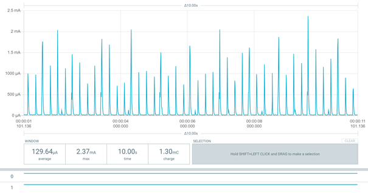  
When initializing the falsh, the power consumption goes up:  
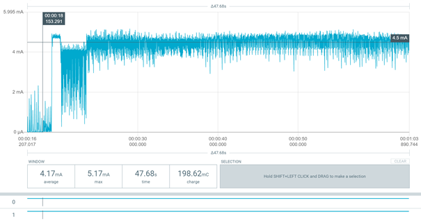  
And settles at an average power consumption of 4.5 mA:  
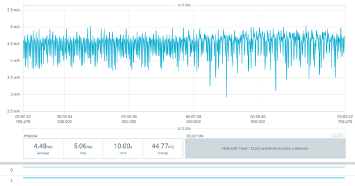  
The process of initializing takes about 2 min and 58 s.   
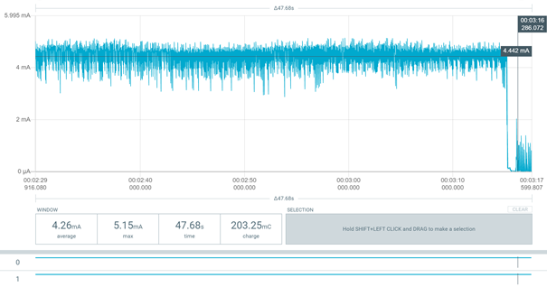  
While logging the energy consumption is about 20 μA higher than before.  

#### High-Performance Mode ####
In high-performance mode, before initializing the flash, an average of 135,26 μA is consumed. That is 6 μA more than in low power mode.  
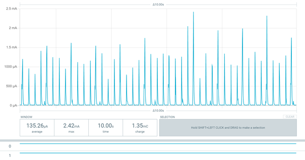  
When initializing the falsh, the power consumption goes up as seen before:  
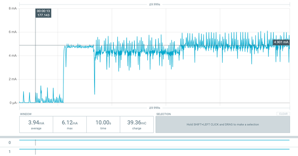  
The average power consumption reached is 0,43 mA higher than in low power mode:   
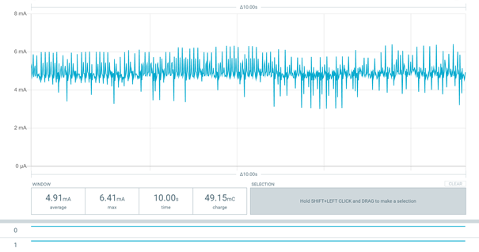  
But on the other hand, the process of initializing takes about 1 min and 42 s that is 1 min and 16 s less than in low power mode.  
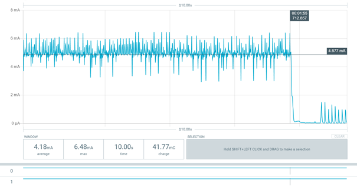  
To evaluate the energy consumption and time difference during flash initialization, the electric power for each mode is calculated:  
Supply voltage: $V_{cc} = 3V$  
Initialization time: $t_{init\_lp}=178 s$ ,  $t_{init\_hp}=102 s$  
Current: $I_{avg\_hp}=4,48 mA$ ,  $I_{avg\_hp}=4,91 mA$  
*Electric power*  
Low-Power: $W_{lp}=3 V∙178 s∙4,43 mA=2,37 Ws$  
High-Performance: $W_{hp}=3 V∙102 s∙4,91 mA=1,50 Ws$  

To reduce the overall power consumption, in normal operation the low power mode is used. Only during flash initialization, the high-performance mode is selected.   

### GitHub Issue #11 Write Performance on External Flash ###
In this issue limitations due to the write performance of the flash or due to the SPI bus speed are evaluated.  
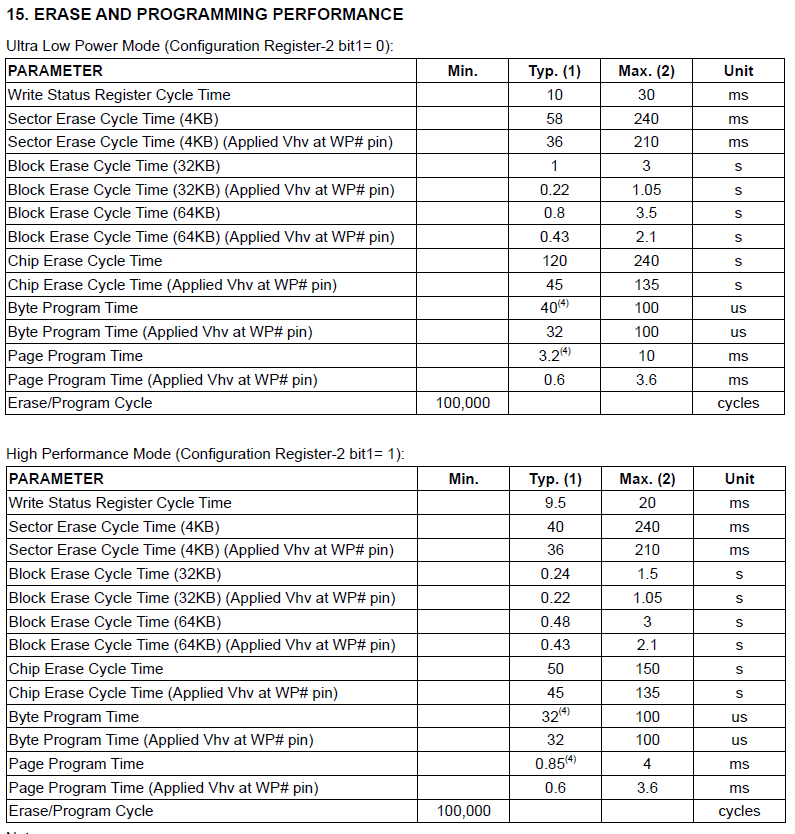  
The max. page program time is 10 ms in low power mode. Worst case - 4 write function calls:  
1. New sector - sector header required  
2. Data header  
3. Data passing over a page border  
4. rest of the data on the next page  
That results in a maximum of 40ms write time.  
The data sent in one SPI message is at least 144 byte, therefore 256 bytes is assumed for further calculations. That results in a transmission time of $\frac{256\bullet8}{8 MHz} = 0,256 ms$. This time is needed for each time the write function is called, which results in an overall worst case time of ~$41ms$ Assuming data is logged with a frequency of 500 Hz, the timeperiod between two write actions is $32\bullet\frac{1}{500 Hz}=64ms$ which is 1.5 times the time consumed for writing (worst case).  
A test with 100Hz and 200Hz frequency at 12Bit resolution (about 200000 byte) workes without an issue.