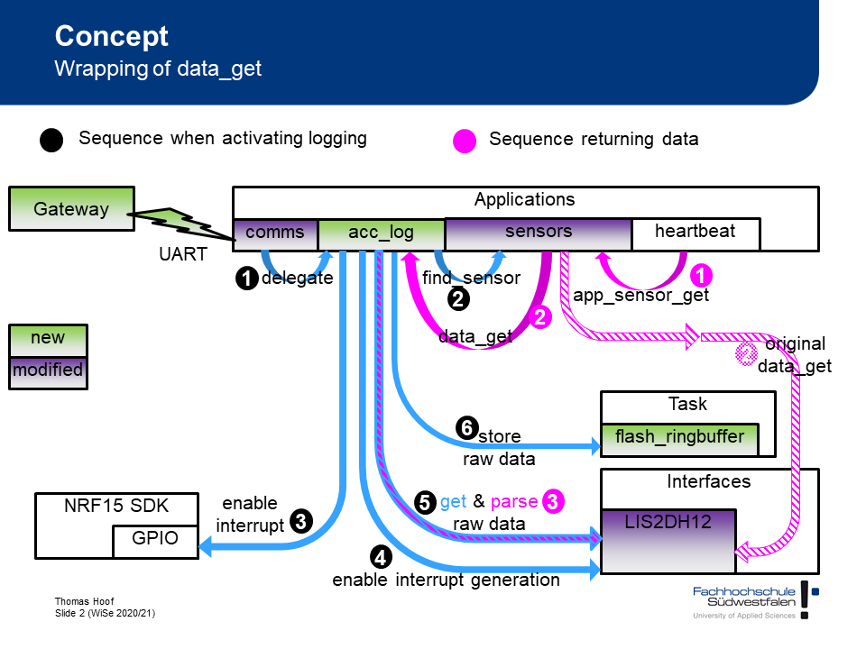

# Sensor

The following figure shows the high level architecture of acceleration data logging in Ruuvi Tag. All configuration is done via the gateway. It communicates with the Ruuvi Tag using the Nordic UART interface via GATT messages transported by Blutooth Low Energy (BLE). Most logic regarding acceleration logging is implemented inside the module app_accelerometer_logging.c.

Three usecases are shown in this figure.

## Initilizing acceleration logging ##
The initialization is shown with blue arrows and numbers in black circles until #4. 

To activate acceleration logging the gateway sends the message **0xFA 0xFA 0x0A 0x01**. In general GATT messages are handled by the function **handle_comms()** inside the module app_comm.c. Message regarding acceleration logging are handled by the function **handle_lis2dh12_comms()** inside the same module. After receiving the message to activate acceleration logging the function **app_enable_sensor_logging()** inside the module app_accelerometer_logging.c in called (1).

The first step in activation is to check if some conditions are fulfilled. The function returns an error code if acceleration logging is already active or if it is called on a sensor which does not include an LIS2DH12. This check is done by calling **find_sensor()** inside of app_sensor.c (2). This function return the sensor context. The sensor context consists of several information abut the sensor. In the next step assiciates the function **on_fifo_full()** from app_accelerometer_logging.c with the interrupt pin retrieved from the sensor context (3). The last step is to activate FIFO and interrupt generation inside the LIS2DH12. This is done by calling two functions from the sensor context. At least the function pointer to **data_get()** inside the sensor context is replaced by the pointer to the function **lis2dh12_logged_data_get()**. 

## Retrieving data from FIFO ##
When FIFO is full inside LIS2DH12 the interrupt starts the function **on_fifo_full()**. This functions does not directly handle the new data. It schedules a call to **fifo_full_handler()**. Instead of **on_fifo_full()** this is called in the main thread of the application. When processing is done inside a function inside an interrupt context this prevents processing of other interrupt. This should be avoided.

Inside **fifo_full_handler()** the FIFO from LIS2DH12 is read (5). The values are store in the memory in raw format to be ready to present them to the function **lis2dh12_logged_data_get()** which is important for heartbesat. In parallel the raw values are compacted by removing all unused bits. This is done by the functions **pack8/10/12()**. A timestamp is added to the compacted values. These values are handover to the ringbuffer which writes them to flash (6).

## Using the data by hearbeat ##
This usecase is shown with magenta arrows and numbers inside magenta circles in the figure above.

The heartbeat retrieves the values from all sensors by calling the function **app_sensor_get()** inside the module app_sensors.c. In the original setup this function calls **ri_lis2dh12_data_get()** inside of ruuvi_interface_lis2dh12.c. During initialization this function is replaced by **lis2dh12_logged_data_get()**.

**lis2dh12_logged_data_get()** retrieves the raw accleration values from memory. Then the values are parsed by calling **ri_lis2dh12_raw_data_parse()** and returned to the heartbeat.

## Initialization during boot ##
All sensor initialization is done inside **setup()** from main.c. This function calls **app_acc_logging_init()** inside app_accelerometer_logging.c. The function checks if the ringbuffer exists. If this is true it activates acceleration logging as described earlier.
