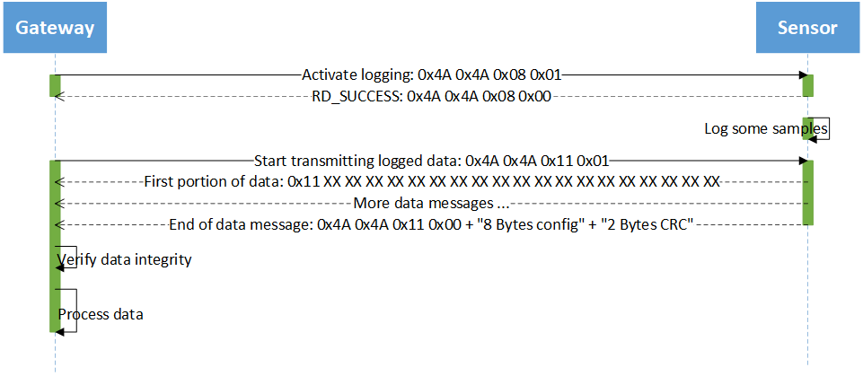

# BLE GATT Messages #

Communication between Gateway and Sensor is done via Bluetooth Low Energy. It uses the Nordic UART service which itself uses the Bluetooth GATT protocol. 

Three types of messages are used.

1. The Gateway sends control messages to the sensor to set or read configuration or start transmission of logged data.
2. The Sensor responds to control messages via response messages. This message type transports status information or configuration data.
3. If the Gateway requests the Sensor to send logged data, this data is sent by data messages. To transport all data many data messages are used in sequence. The end of data is signaled by a response message.

The messages are differentiated by the first byte. 

## Control messages ##

Control messages are indicated by the value `0xFA` in the first position. This byte is repeated in the second position. The type of the message is distinguished by the third byte. The general structure of a control message is show in the following table.

| Header | Header | Type | Parameter |
|-|-|-|-|
| `0xFA` | `0xFA` | XX | Zero or more Parameter |

Control messages must be padded by nullbytes to a minimum length of 11 bytes. This requirement is introduced by the Ruuvi firmware. The padding bytes are not shown in the following description of the messages.

### Start transmitting last sample (`0x03`) ###

This message starts transmitting the last sample of acceleration data. This sample consists of 32 tuples of (X,Y,Z) values. It is taken from RAM and transmitted to the gateway by using data messages. The transmission of the data is followed by a [end of data message](ble-gatt-messages.html#end-of-data-message-0x03-0x05) which signals the end of the data. 

This message takes no parameters. It's concrete content is: `0xFA 0xFA 0x03`.

If acceleration logging is not active, the Sensor responds a [status response](ble-gatt-messages.html#status-response-0x00) containing error code `RD_ERROR_INVALID_STATE`.

### Start transmitting logged data (`0x05`) ###

This message starts transmitting the logged acceleration data from the ringbuffer. The data includes the last page which is not complete full and is not yet written to flash. The transmission of the data is followed by a [end of data message](ble-gatt-messages.html#end-of-data-message-0x03-0x05) which signals the end of the data. After downloading the logged data, the ringbuffer is empty.

This message takes no parameters. Its concrete content is: `0xFA 0xFA 0x05`.

If acceleration logging is not active, the Sensor responds with a [status response](ble-gatt-messages.html#status-response-0x00) containing error code `RD_ERROR_INVALID_STATE`.

### Set configuration of acceleration sensor (`0x06`) ###

This message is used to set the configuration of the acceleration sensor (LIS2DH12). The message takes 8 Parameters. The Sensor responds to this message with a [status response](ble-gatt-messages.html#status-response-0x00). The parameters are as follows.

| Parameter | Description |
|-|-|
| P1 | Rate of sampling in smaples per second. Allowed values are 1Hz, 10Hz, 25Hz, 50Hz, 100Hz, 200Hz, 400Hz. |
| P2 | Resolution in bits. Allowed values are 8, 10, 12. |
| P3 | Measuring range. Allowed values are 2G, 4G, 8G, 16G. |
| P4 | DSP function. See datasheet of LIS2DH12. |
| P5 | DSP parameter. See datasheet of LIS2DH12. |
| P6 | Mode of operation. Allowed values are `0xF2`, `0xF3`, `0xF4`. See datasheet of LIS2DH12. |
| P7 | Reserved. Set to `0x00`. |
| P8 | Reserved. Set to `0x00`. |

All values from P1 to P6 can be set to `0xFF` which means 'do not change this values'.

The concrete content of this message is `0xFA 0xFA 0x06 P1 P2 P3 P4 P5 P6 P7 P8`.

### Read configuration of acceleration sensor (`0x07`) ###

This message is used to read the configuration of the acceleration sensor (LIS2DH12). The message takes no parameters. The Sensor responds to this message either by a [status response](ble-gatt-messages.html#status-response-0x00) containing an error code or by a [response message which transmits the configuration](ble-gatt-messages.html#configuration-response-0x07).

The concrete content of this message is: `0xFA 0xFA 0x07`.

### Set system time (`0x08`) ###

This message is used to set the RTC of the sensor to a timestamp which is part of the message. The timestamp must be a 8 byte UNIX timestamp. It must be transmitted in [little-endian][endianess] byte sequence. The sensor responds to this message with a [status response](ble-gatt-messages.html#status-response-0x00).

The concrete content of this message is `0xFA 0xFA 0x08 XX XX XX XX XX XX XX XX`.

### Read system time (`0x09`) ###

This message is used to read the RTC of the sensor. The sensor responds to this message with a [status response](ble-gatt-messages.html#status-response-0x00) containing an error code or with a [timestamp response](ble-gatt-messages.html#timestamp-response-0x09).

The concrete content of this message is `0xFA 0xFA 0x09`.

### Control acceleration logging (`0x0A`) ###

This message is used to activate or deactivate acceleration logging. It takes one parameter. The parameter is interpreted as a boolean value. If it maps to true acceleration logging is activated. If it maps to false acceleration logging is deactivated. The sensor responds to this message using a [status response](ble-gatt-messages.html#status-response-0x00). Activating acceleration logging when it is already active results in an error. Deactivating acceleration logging when it is not active results in an error.

The concrete content of this message is `0xFA 0xFA 0x0A XX`. Where `XX` can be `0x00` or `0x01`.

### Query status of acceleration logging (`0x0B`) ###

This message is used to query the status of acceleration logging. The sensor responds to this message with a [status response](ble-gatt-messages.html#status-response-0x00). If logging is active, the response contains the status `RD_SUCCESS` if logging is not active the status is `RD_ERROR_NOT_INITIALIZED`.

The concrete content of this message is `0xFA 0xFA 0x0B`.

## Response messages ##

Response messages are indicated by the value `0xFB` as the first byte. The type of the message is differentiated by the second byte. The general structure of a response message is show in the following table.

| Header | Type | status | Parameter |
|-|-|-|-|
| `0xFB` | XX | status | Zero or more Parameter |

Every response message returns a status code as the result of the processing as the third byte. It must be interpreted as a bitfield. The bits represent the different error conditions. The following table show the error conditions. In case of mulpilte arrors more than one bit can be set. If no bit is set the processing was successful.

| Value | Error |
|-|-|
| status==0 | RD_SUCCESS: No error
| 1         | RD_ERROR_INTERNAL: Internal Error
| 2         | RD_ERROR_NO_MEM: No Memory for operation
| 4         | RD_ERROR_NOT_FOUND: Not found
| 8         | RD_ERROR_NOT_SUPPORTED: Not supported
| 16        | RD_ERROR_INVALID_PARAM: Invalid Parameter
| 32        | RD_ERROR_INVALID_status: Invalid status, operation disallowed in this status
| 64        | RD_ERROR_INVALID_LENGTH: Invalid Length
| 128       | RD_ERROR_INVALID_FLAGS: Invalid Flags
| 256       | RD_ERROR_INVALID_DATA: Invalid Data
| 512       | RD_ERROR_DATA_SIZE: Invalid Data size
| 1024      | RD_ERROR_TIMEOUT: Operation timed out
| 2048      | RD_ERROR_NULL: Null Pointer
| 4096      | RD_ERROR_FORBIDDEN: Forbidden Operation
| 8192      | RD_ERROR_INVALID_ADDR: Bad Memory Address
| 16384     | RD_ERROR_BUSY: Flash Busy
| 32768     | RD_ERROR_RESOURCES: Not enough resources for operation
| 65535     | RD_ERROR_NOT_IMPLEMENTED: Not implemented yet
| 131072    | RD_ERROR_SELFTEST: Self-test fail
| 262144    | RD_STATUS_MORE_AVAILABLE: Driver has more data queued
| 524288    | RD_ERROR_NOT_INITIALIZED: Driver is not initialized.
| 1048576   | RD_ERROR_NOT_ACKNOWLEDGED: Ack was expected but not received
| 2097152   | RD_ERROR_NOT_ENABLED: Driver is not enabled

### Status response (`0x00`) ###

This message is used to return a status code to the gateway if no other information is available.

The concrete content of this message is `0xFB 0x00 SS`. Where `SS` is the status code.

### End of data message (`0x03`, `0x05`) ###

This message is sent to the gateway after returning data. It signals the end of the transmission. The type byte (`0x03`, `0x05`) maps to the type of data requested. This message contains nine parameters. The current configuration of the acceleration sensor are the first eight parameter. The structure is the same as shown in the [set configuration message](ble-gatt-messages.html#set-configuration-of-acceleration-sensor-0x06). The CRC16 value of the transmitted data is the 9th parameter.

To compute the CRC16 value the polynom `0x11021` with the initial value `0xFFFF` is used. The output bytes are not reversed and not XOR'd. The CRC value is of size 2 bytes. It is transfered in [little-endian][endianess] byte sequence.

The concrete content of this message is `0xFB 0x03/0x05 P1 P2 P3 P4 P5 P6 P7 P8 CRC1 CRC2`. 

### Configuration response (`0x07`) ###

This message is sent to the gateway after requesting the current configuration. The message contains one parameter containing the current configuration.

The concrete content of this message is `0xFB 0x07 P1 P2 P3 P4 P5 P6 P7 P8`. The values P1 to P8 map to the same values as shown in [set configuration message](ble-gatt-messages.html#set-configuration-of-acceleration-sensor-0x06).

### Timestamp response (`0x09`) ###

This message is sent to the gateway after requesting the system time. The message contains one parameter. The parameter is a 8 byte value containing the current timestamp. The bytes are transferred in [little-endian][endianess] sequence.

The concrete content of this message is `0xFB 0x09 XX XX XX XX XX XX XX XX`. 

## Data message ##

Data messages are used to transfer logged acceleration data. A data message starts with the byte `0xFC`. After the start byte there follows up to 19 bytes of data.

The concrete content of this message is `0xFC XX XX XX XX XX XX XX XX XX XX XX XX XX XX XX XX XX XX XX`. 

The data is returned in blocks of 32 tuples of x-, y-, z-values. Every block is preceded by the timestamp when the interrupt occured which this block generates. To decode the data block the information about the resolution and the scale is needed. This information is transmitted by the [end of data message](ble-gatt-messages.html#end-of-data-message-0x03-0x05). All values are transferred in [little-endian][endianess] byte sequence.

After de-compacting every value must be interpreted as the most significant part of an 16 bit wide signed integer. To get the real acceleration value from this intermediate value multiply it by one of the following factors.

| Scale / Resolution | 8 bit | 10 bit | 12 bit |
|-|-|-|-|
|  2G |  $\frac{16}{256*1000}$ |  $\frac{4}{64*1000}$ |  $\frac{1}{16*1000}$ |
|  4G |  $\frac{32}{256*1000}$ |  $\frac{8}{64*1000}$ |  $\frac{2}{16*1000}$ |
|  8G |  $\frac{64}{256*1000}$ | $\frac{16}{64*1000}$ |  $\frac{4}{16*1000}$ |
| 16G | $\frac{192}{256*1000}$ | $\frac{48}{64*1000}$ | $\frac{12}{16*1000}$ |

### 12 bit data format ###

In 12 bit resolution mode two values are transmitted inside 3 bytes. See following figure.

### 10 bit data format ###

In 10 bit resolution mode four values are transmitted inside 5 bytes. See following figure.

### 8 bit data format ###

In 8 bit resolution mode every value is transmitted seperatly. See following figure.

## Communication example ##

The following figure shows an example communication.

[endianess]: https://en.wikipedia.org/wiki/Endianness#Example
